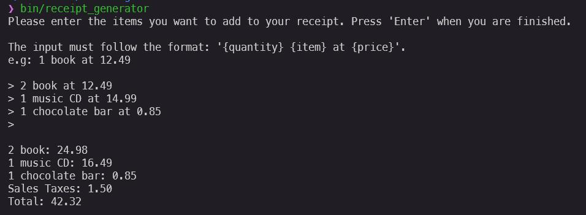
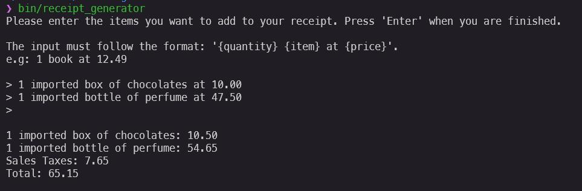
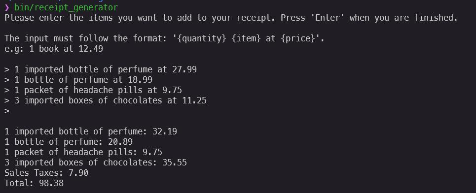

# Subscribe - challenge

- [Link to Challenge](https://gist.github.com/safplatform/792314da6b54346594432f30d5868f36)

## Description
This is a simple Ruby application that generates a receipt for purchased items. It takes a list of items, their prices, and quantity, and generates a formatted receipt.

## Dependencies
- Ruby ~> 3.4.2
- Bundler

## Setup
1. Clone the repository
2. Run `bundle install` to install the dependencies
3. Run `bundle exec rspec` to run the tests

## Usage
1. Run `bin/receipt_generator` to fire up the receipt generator
2. Input the items in the format: `{quantity} {item} at {price}`. E.g. `2 book at 12.49`
3. Press `Enter` to inputting item
4. Press `Enter` again (with no input) to finish

Examples:

##### Input 1

##### Input 2

##### Input 3

